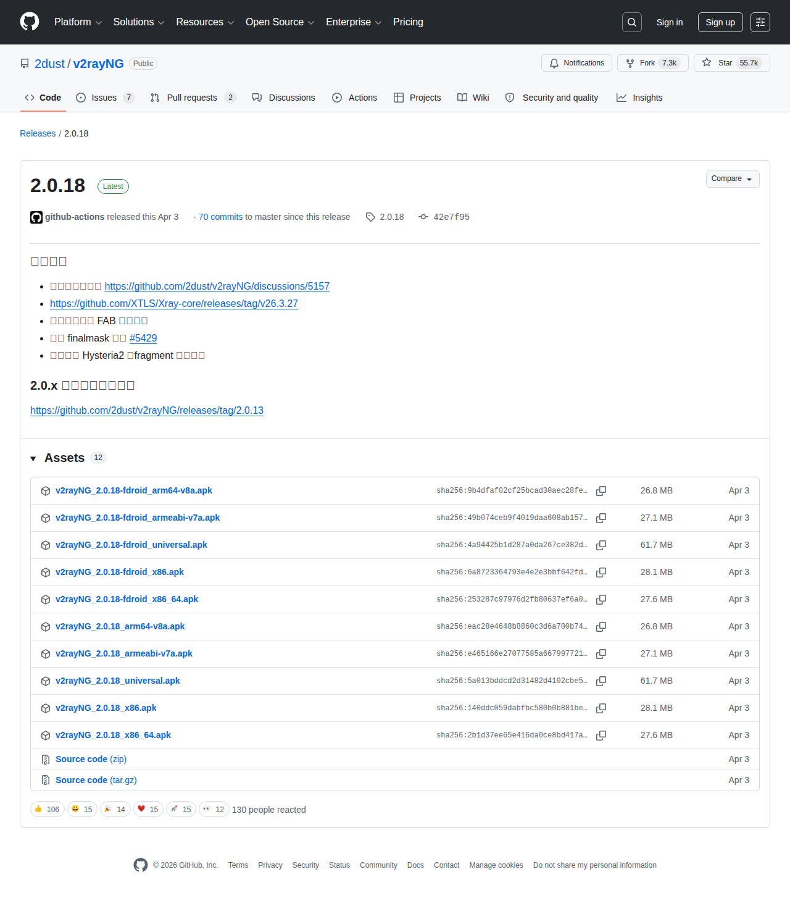

# Visited: https://github.com/2dust/v2rayNG/releases/tag/2.0.18
**Time:** Sat May  9 00:40:32 UTC 2026

## Screenshot

## Raw HTML
[page.html](./page.html)

## Downloaded Media (10 files)
## Downloaded Media Files

## Other Links
- [#start-of-content](#start-of-content)
- [/](/)
- [/2dust](/2dust)
- [/2dust/v2rayNG](/2dust/v2rayNG)
- [/2dust/v2rayNG/actions](/2dust/v2rayNG/actions)
- [/2dust/v2rayNG/commit/42e7f95e4f7499037792bd347013c27d871ecfac](/2dust/v2rayNG/commit/42e7f95e4f7499037792bd347013c27d871ecfac)
- [/2dust/v2rayNG/compare/2.0.18...master](/2dust/v2rayNG/compare/2.0.18...master)
- [/2dust/v2rayNG/discussions](/2dust/v2rayNG/discussions)
- [/2dust/v2rayNG/issues](/2dust/v2rayNG/issues)
- [/2dust/v2rayNG/projects](/2dust/v2rayNG/projects)
- [/2dust/v2rayNG/pulls](/2dust/v2rayNG/pulls)
- [/2dust/v2rayNG/pulse](/2dust/v2rayNG/pulse)
- [/2dust/v2rayNG/refs?tag_name=2.0.18&amp;experimental=1](/2dust/v2rayNG/refs?tag_name=2.0.18&amp;experimental=1)
- [/2dust/v2rayNG/releases](/2dust/v2rayNG/releases)
- [/2dust/v2rayNG/releases/latest](/2dust/v2rayNG/releases/latest)
- [/2dust/v2rayNG/releases/tag/2.0.18](/2dust/v2rayNG/releases/tag/2.0.18)
- [/2dust/v2rayNG/security](/2dust/v2rayNG/security)
- [/2dust/v2rayNG/tags](/2dust/v2rayNG/tags)
- [/2dust/v2rayNG/tree/2.0.18](/2dust/v2rayNG/tree/2.0.18)
- [/2dust/v2rayNG/wiki](/2dust/v2rayNG/wiki)
- [/apps/github-actions](/apps/github-actions)
- [/login?return_to=%2F2dust%2Fv2rayNG](/login?return_to=%2F2dust%2Fv2rayNG)
- [/login?return_to=https%3A%2F%2Fgithub.com%2F2dust%2Fv2rayNG%2Freleases%2Ftag%2F2.0.18](/login?return_to=https%3A%2F%2Fgithub.com%2F2dust%2Fv2rayNG%2Freleases%2Ftag%2F2.0.18)
- [/manifest.json](/manifest.json)
- [/opensearch.xml](/opensearch.xml)
- [/search/custom_scopes/check_name](/search/custom_scopes/check_name)
- [/signup?ref_cta=Sign+up&amp;ref_loc=header+logged+out&amp;ref_page=%2F%3Cuser-name%3E%2F%3Crepo-name%3E%2Freleases%2Fshow&amp;source=header-repo&amp;source_repo=2dust%2Fv2rayNG](/signup?ref_cta=Sign+up&amp;ref_loc=header+logged+out&amp;ref_page=%2F%3Cuser-name%3E%2F%3Crepo-name%3E%2Freleases%2Fshow&amp;source=header-repo&amp;source_repo=2dust%2Fv2rayNG)
- [https://archiveprogram.github.com](https://archiveprogram.github.com)
- [https://avatars.githubusercontent.com](https://avatars.githubusercontent.com)
- [https://avatars.githubusercontent.com/in/15368?s=40&amp;v=4](https://avatars.githubusercontent.com/in/15368?s=40&amp;v=4)
- [https://docs.github.com](https://docs.github.com)
- [https://docs.github.com/](https://docs.github.com/)
- [https://docs.github.com/search-github/github-code-search/understanding-github-code-search-syntax](https://docs.github.com/search-github/github-code-search/understanding-github-code-search-syntax)
- [https://docs.github.com/site-policy/github-terms/github-terms-of-service](https://docs.github.com/site-policy/github-terms/github-terms-of-service)
- [https://docs.github.com/site-policy/privacy-policies/github-privacy-statement](https://docs.github.com/site-policy/privacy-policies/github-privacy-statement)
- [https://github-cloud.s3.amazonaws.com](https://github-cloud.s3.amazonaws.com)
- [https://github.blog](https://github.blog)
- [https://github.blog/changelog](https://github.blog/changelog)
- [https://github.com](https://github.com)
- [https://github.com/2dust/v2rayNG/discussions/5157](https://github.com/2dust/v2rayNG/discussions/5157)
- [https://github.com/2dust/v2rayNG/pull/5429](https://github.com/2dust/v2rayNG/pull/5429)
- [https://github.com/2dust/v2rayNG/releases/expanded_assets/2.0.18](https://github.com/2dust/v2rayNG/releases/expanded_assets/2.0.18)
- [https://github.com/2dust/v2rayNG/releases/tag/2.0.13](https://github.com/2dust/v2rayNG/releases/tag/2.0.13)
- [https://github.com/XTLS/Xray-core/releases/tag/v26.3.27](https://github.com/XTLS/Xray-core/releases/tag/v26.3.27)
- [https://github.com/accelerator](https://github.com/accelerator)
- [https://github.com/collections](https://github.com/collections)
- [https://github.com/customer-stories](https://github.com/customer-stories)
- [https://github.com/enterprise](https://github.com/enterprise)
- [https://github.com/enterprise/startups](https://github.com/enterprise/startups)
- [https://github.com/features](https://github.com/features)

## Stats
- Links: 205
- Media: 10
